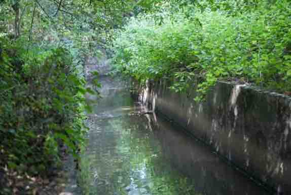
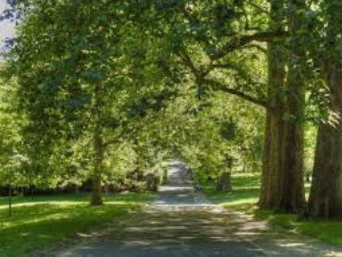
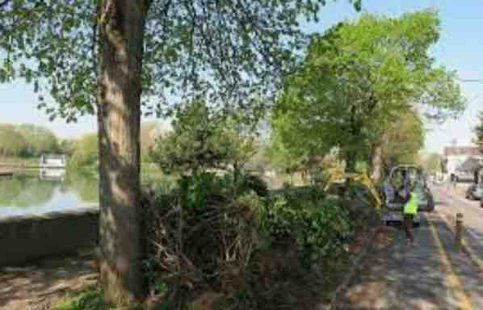
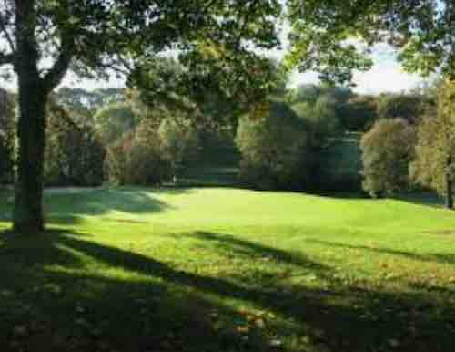
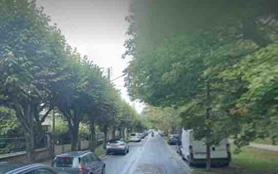

```{r setup, include=FALSE}
library(flexdashboard)
library(ggplot2)
library(plotly)
library(sf)
library(dplyr)
library(htmlwidgets)
library(leaflet)
library(htmltools)
library(knitr)
library(leafpop)


map_iris<-readRDS("data/map_iris.Rdata")


sel2<-c("940680701",
        "940680702",
        "940680703",
        "940680601",
        "940680602",
        "940680603",
        "940680105",
        "940680109" )
canton18<- map_iris %>% filter(INSEE_COM %in% c("94071","94055","94011")|CODE_IRIS %in% sel2) %>% summarise() %>% st_as_sf()
canton18<- st_transform(canton18, 4326)

anticanton18<-map_iris %>% filter(!(INSEE_COM %in% c("94071","94055","94011")|CODE_IRIS %in% sel2)) %>% summarise() %>% st_as_sf()
anticanton18<- st_transform(anticanton18, 4326)

mapcom<-readRDS("data/map_com.Rdata")
mapcom<- st_transform(mapcom, 4326)

bpe<-readRDS("data/bpe2019_94_map.Rdata")
bpe<-st_transform(bpe, 4326)


icon.leaf <- makeAwesomeIcon(icon = 'leaf', markerColor = 'lightgreen', library='fa', iconColor = 'red')
icon.bug<- makeAwesomeIcon(icon = 'bug', markerColor = 'lightgreen', library='fa', iconColor = 'red')
icon.tree<- makeAwesomeIcon(icon = 'tree', markerColor = 'lightgreen', library='fa', iconColor = 'red')
icon.recycle<- makeAwesomeIcon(icon = 'recycle', markerColor = 'lightgreen', library='fa', iconColor = 'red')
icon.heart<- makeAwesomeIcon(icon = 'heart', markerColor = 'lightgreen', library='fa', iconColor = 'red')
icon.random<- makeAwesomeIcon(icon = 'random', markerColor = 'lightgreen', library='fa', iconColor = 'red')
icon.cutlery<- makeAwesomeIcon(icon = 'cutlery', markerColor = 'lightgreen', library='fa', iconColor = 'red')
```

### DIX ACTIONS LOCALES POUR LA PROTECTION DE LA BIODIVERSITE

```{r}

     proposition1 = paste0(
      "<b> BEC DE CANARD",
      "</b><br/><br/>",
      "Rétablir la divagation naturelle du Morbras dans un site réhabilité pour l'expansion de crues et préserver la forêt alluviale sur Sucy")

     proposition2 = paste0(
      "<b> PARC DU RAINCY",
      "</b><br/><br/>",
      "Mettre en place gestion différenciée des parcs départementaux et les relier par des corridors écologique aux espaces naturels environnants")
    
       proposition3 = paste0(
      "<b> QUAI DE LA PIE",
      "</b><br/><br/>",
      " Améliorer de l'assainissement de la Marne en séparant les eaux usées pour rétablir une bonne qualité d'eaux de baignade.")

       
       proposition4 = paste0(
      "<b> VALLEE DU MORBRAS",
      "</b><br/><br/>",
      "Protéger l'espace naturel sensisble de la vallée du Morbras de tout empiètement et limiter l'éclairage pour préserver les espèces animales sensibles à la lumière")
       
       proposition5 = paste0(
      "<b> RU DE LA FONTAINE DE VILLIERS",
      "</b><br/><br/>",
      "Construire une piste cyclable assurant la liaison entre le plateau de Brie et la vallée de la Marne le long de ce talweg qui offre la pente la plus facile.")
       
      proposition6 = paste0(
      "<b> GOLF D'ORMESSON",
      "</b><br/><br/>",
      "Effectuer un diagnostic des continuités écologiques qui traversent cet espace et nous proposons de les améliorer si nécessaire.")
              
     proposition7 = paste0(
      "<b> FORET NOTRE_DAME",
      "</b><br/><br/>",
      "Empêcher toute dérogation au statut de forêt de protection. Effectuer un diagnostic des arbres menacées par le réchauffement climatique et éviter le reboisement en conifères.")

     proposition8 = paste0(
      "<b> PROLONGEMENT RN406",
      "</b><br/><br/>",
      "Protéger les espèces menacées par la nouvelle infrastrtucture (notamment les crapaud calamite) et restaurer leur habitat.")
     
      
            proposition9 = paste0(
      "<b> NATURALISATION DES ROUTES",
      "</b><br/><br/>",
      "Restreindre l'élagage et renforcer la naturalisation des trottoirs sur l'ensemble des voies départementales en limitant si besoin les places de parking.")
            
            
            proposition10 = paste0(
      "<b> PLAINE DE NOISEAU",
      "</b><br/><br/>",
      "Protéger les dernières terres agricoles du département contre les projets d'urbanisation déguisés en agroquartier et développer les circuits courts vers les marchés du canton.")


mymap<-  leaflet() %>%
      addTiles() %>%
 #     addProviderTiles(providers$Stamen.TonerLite) %>%
 #         addProviderTiles(providers$Stamen.Toner) %>%
        setView(lng=2.53, lat=48.774 , zoom=13) %>%
        addPolygons(data = mapcom, fill= FALSE, color = 'gray',weight =2) %>%
          
        addPolygons(data = anticanton18, 
                    fillColor = "gray", 
                    fillOpacity = 0.2,
                    color = 'gray',
                    weight =1) %>%
  
        addPolygons(data = canton18, 
                    fillColor = "lightyellow", 
                    fillOpacity = 0.2, 
                    color = 'red',
                    weight =4) %>%
 
           addAwesomeMarkers(lat = 48.782, lng=2.510,
                      icon=icon.random,
                      # En passant la souris
                      label = "BEC DE CANARD", 
                      # En cliquant sur l'icone
                       popup = proposition1,
                      # Quelques options de la popup
                       popupOptions = 
                     list(maxHeight = 300, maxWidth = 200)) %>%
  
          addAwesomeMarkers(lat = 48.777, lng=2.480,
                       icon = icon.leaf,
                      # En passant la souris
                      label = "PARC DU RAINCY", 
                      # En cliquant sur l'icone
                       popup = proposition2,
                      # Quelques options de la popup
                       popupOptions = 
                     list(maxHeight = 300, maxWidth = 200)) %>%
  
            addAwesomeMarkers(lat = 48.7847, lng=2.4859,
                      # En passant la souris
                      icon = icon.random,
                      label = "QUAI DE LA PIE", 
                      # En cliquant sur l'icone
                       popup = proposition3,
                      # Quelques options de la popup
                       popupOptions = 
                     list(maxHeight = 300, maxWidth = 200)) %>%
             
            addAwesomeMarkers(lat = 48.777, lng=2.530,
                      # En passant la souris
                      label = "VALLEE DU MORBRAS", 
                      icon = icon.bug,
                      # En cliquant sur l'icone
                       popup = proposition4,
                      # Quelques options de la popup
                       popupOptions = 
                     list(maxHeight = 300, maxWidth = 200)) %>%
  
           addAwesomeMarkers(lat = 48.770, lng=2.540,
                        icon = icon.leaf,
                      # En passant la souris
                      label = "RU DE LA FONTAINE DE VILLIERS", 
                      # En cliquant sur l'icone
                       popup = proposition5,
                      # Quelques options de la popup
                       popupOptions = 
                     list(maxHeight = 300, maxWidth = 200)) %>%
  
          addAwesomeMarkers(lat = 48.787, lng=2.556,
                        icon = icon.bug,
                      # En passant la souris
                      label = "GOLFE D'ORMESSON", 
                      # En cliquant sur l'icone
                       popup = proposition6,
                      # Quelques options de la popup
                       popupOptions = 
                     list(maxHeight = 300, maxWidth = 200)) %>%
  
               addAwesomeMarkers(lat = 48.762, lng=2.577,
                      icon=icon.leaf,
                      # En passant la souris
                      label = "FORET NOTRE-DAME", 
                      # En cliquant sur l'icone
                       popup = proposition7,
                      # Quelques options de la popup
                       popupOptions = 
                     list(maxHeight = 300, maxWidth = 200)) %>%
  
  
           addAwesomeMarkers(lat = 48.771, lng=2.500,
                         icon=icon.bug,
                      # En passant la souris
                      label = "PROLONGEMENT RN406", 
                      # En cliquant sur l'icone
                       popup = proposition8,
                      # Quelques options de la popup
                       popupOptions = 
                     list(maxHeight = 300, maxWidth = 200)) %>%


              addAwesomeMarkers(lat = 48.7658, lng=2.5333,
                         icon = icon.random,
                      # En passant la souris
                      label = "NATURALISATION DES ROUTES", 
                      # En cliquant sur l'icone
                     popup = proposition9,
                      # Quelques options de la popup
                       popupOptions = 
                     list(maxHeight = 300, maxWidth = 200)) %>%


              addAwesomeMarkers(lat = 48.7792, lng=2.5576,
                         icon = icon.heart,
                      # En passant la souris
                      label = "PROTEGER LES TERRES AGRICOLES", 
                      # En cliquant sur l'icone
                     popup = proposition10,
                      # Quelques options de la popup
                       popupOptions = 
                     list(maxHeight = 300, maxWidth = 200)) 


mymap
```


