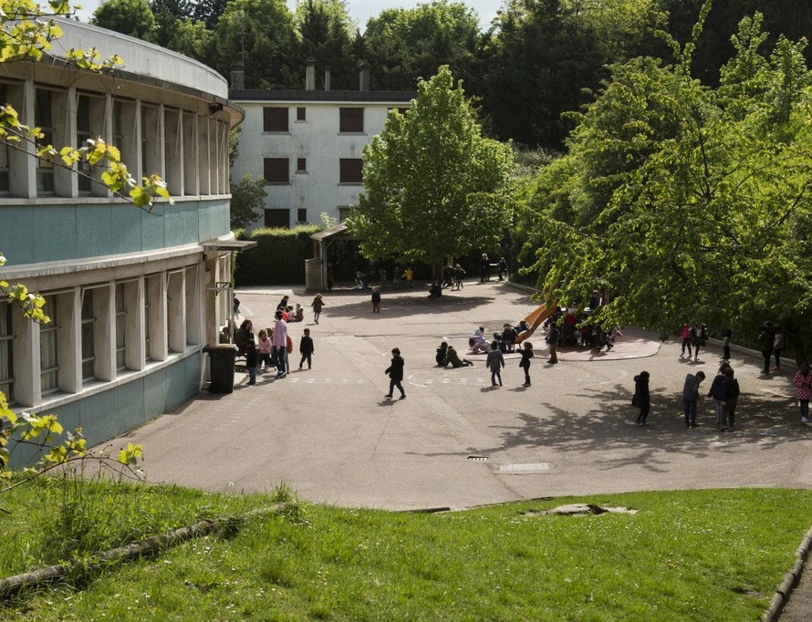
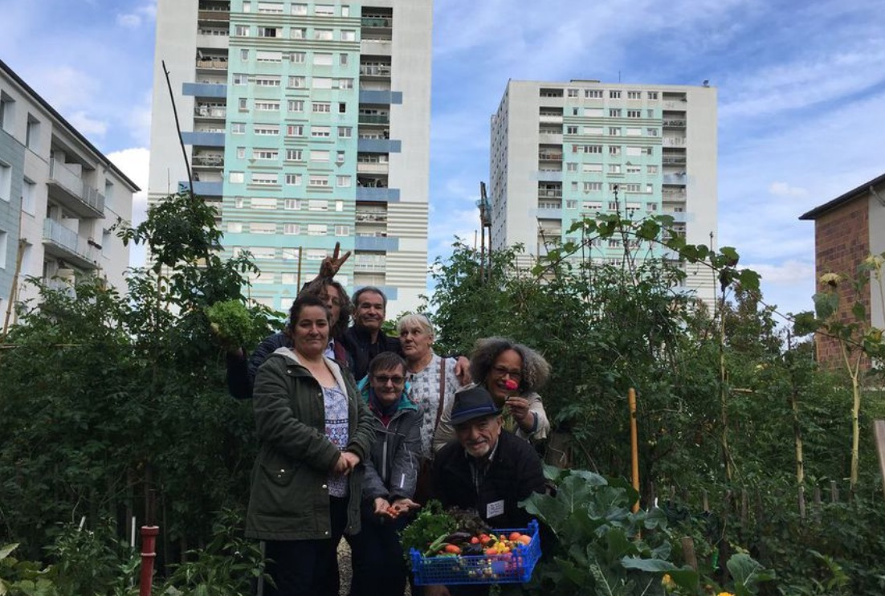
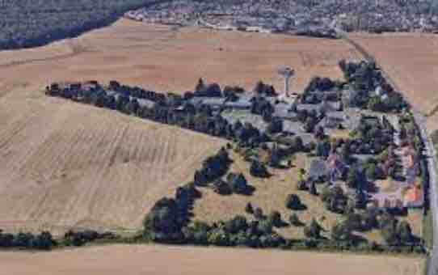

```{r setup, include=FALSE}
library(flexdashboard)
library(ggplot2)
library(plotly)
library(sf)
library(dplyr)
library(htmlwidgets)
library(leaflet)
library(htmltools)
library(knitr)
library(leafpop)


map_iris<-readRDS("data/map_iris.Rdata")


sel2<-c("940680701",
        "940680702",
        "940680703",
        "940680601",
        "940680602",
        "940680603",
        "940680105",
        "940680109" )
canton18<- map_iris %>% filter(INSEE_COM %in% c("94071","94055","94011")|CODE_IRIS %in% sel2) %>% summarise() %>% st_as_sf()
canton18<- st_transform(canton18, 4326)

anticanton18<-map_iris %>% filter(!(INSEE_COM %in% c("94071","94055","94011")|CODE_IRIS %in% sel2)) %>% summarise() %>% st_as_sf()
anticanton18<- st_transform(anticanton18, 4326)

mapiris<-readRDS("data/suroc.RDS")

mapcom<-readRDS("data/map_com.Rdata")
mapcom<- st_transform(mapcom, 4326)

bpe<-readRDS("data/bpe2019_94_map.Rdata")
bpe<-st_transform(bpe, 4326)


icon.leaf <- makeAwesomeIcon(icon = 'leaf', markerColor = 'lightgreen', library='fa', iconColor = 'red')
icon.bug<- makeAwesomeIcon(icon = 'bug', markerColor = 'lightgreen', library='fa', iconColor = 'red')
icon.tree<- makeAwesomeIcon(icon = 'tree', markerColor = 'lightgreen', library='fa', iconColor = 'red')
icon.recycle<- makeAwesomeIcon(icon = 'recycle', markerColor = 'lightgreen', library='fa', iconColor = 'red')
icon.heart<- makeAwesomeIcon(icon = 'heart', markerColor = 'lightgreen', library='fa', iconColor = 'red')
icon.random<- makeAwesomeIcon(icon = 'random', markerColor = 'lightgreen', library='fa', iconColor = 'red')
icon.cutlery<- makeAwesomeIcon(icon = 'cutlery', markerColor = 'lightgreen', library='fa', iconColor = 'red')
icon.building<- makeAwesomeIcon(icon = 'building', markerColor = 'lightgreen', library='fa', iconColor = 'red')
icon.bicycle<- makeAwesomeIcon(icon = 'bicycle', markerColor = 'lightgreen', library='fa', iconColor = 'red')

```

### AGIR POUR LE LOGEMENT

```{r}

     proposition1 = paste0(
      "<b>LA CITE VERTE",
      "</b><br/><br/>",
      "Achever la rénovation thermique des bâtiments et assurer la maintenance de la géothermie pour réduire les charges des locataires et les émissions de CO2.")

     proposition2 = paste0(
      "<b>LA FOSSE ROUGE",
      "</b><br/><br/>",
      "Préserver la qualité de l'environnement contre la spéculation et développer les commerces et services de proximité. Contrôler la présence d'amiante dans l'école.")
    
       proposition3 = paste0(
      "<b>NOYERS ET BERGES",
      "</b><br/><br/>",
      " Désenclaver les quartiers des Noyers et des Berges en les reliant par de vraies pistes cyclables à la gare de Sucy et en installant une passerelle vélo pour traverser la Marne.")

       
       proposition4 = paste0(
      "<b>PARTAGE ENTRE GENERATIONS",
      "</b><br/><br/>",
      "Faciliter l'accueil de jeunes travailleurs ou étudiants pour les retraités et personnes isolées disposant d'un logement sous-occupé")
       

       proposition5 = paste0(
      "<b>COLOCATION ENTRE SENIORS",
      "</b><br/><br/>",
      "Encourager la colocation entre seniors pour réduire l'isolement et limiter la sous-occupation des logements.")
       
       
      proposition6 = paste0(
      "<b> COTEAUX D'ORMESSON",
      "</b><br/><br/>",
      "Augmenter de façon significative la part des logements sociaux destinés aux plus défavorisés. Relier le nouveau quartier par des pistes cyclables au centre-ville d'Ormesson et aux gares de Sucy et La Varenne")
              
     proposition7 = paste0(
      "<b> FORET NOTRE_DAME",
      "</b><br/><br/>",
      "Empêcher toute dérogation au statut de forêt de protection. Effectuer un diagnostic des arbres menacées par le réchauffement climatique et éviter le reboisement en conifères.")

     proposition8 = paste0(
      "<b> PROLONGEMENT RN406",
      "</b><br/><br/>",
      "Protéger les espèces menacées par la nouvelle infrastrtucture (notamment les crapaud calamite) et restaurer leur habitat.")
     
      
            proposition9 = paste0(
      "<b> NATURALISATION DES ROUTES",
      "</b><br/><br/>",
      "Restreindre l'élagage et renforcer la naturalisation des trottoirs sur l'ensemble des voies départementales en limitant si besoin les places de parking.")
            
            
            proposition10 = paste0(
      "<b> PLAINE DE NOISEAU",
      "</b><br/><br/>",
      "Protéger les dernières terres agricoles du département contre les projets d'urbanisation déguisés en agroquartier et développer les circuits courts vers les marchés du canton.")

##### CARTO #####        
 # Choix de la variable
mapiris$Pj_i[mapiris$Xi<250]<-NA
   mapiris$myvar <-round(100*mapiris$Pj_i,1)
# Choix des classes 
    mycut<-c(0,5,10,15,20,100)
# Choix de la palette (c'est une fonction !)
   mypal <- colorBin('Blues', 
                       mapiris$myvar,
                       bins=mycut,
                     na.color=NA)
  
   
# Calcul du diamètre des cercles
   mapiris$myradius <-4*sqrt(mapiris$Xij/max(mapiris$Xij))
   
# Préparation des popups
      mypopups <- lapply(seq(nrow(mapiris)), function(i) {
      paste0(  paste("Canton          : ",mapiris$lab_i2[i]), '<br>',
               paste("Iris              : " ,mapiris$lab_i[i]), '<br>', 
               paste("Logt. (hors studio 1 pers) : " ,round(mapiris$Xi[i],0)), '<br>', 
               paste("Logt. suroccupés : " ,round(mapiris$Xij[i],0)), '<br>',                
               paste("% suroccupation     :", mapiris$myvar[i])
            ) 
            })
      mypopups<-lapply(mypopups, htmltools::HTML)           
            
            
            
            

mymap<-  leaflet() %>%
  #    addTiles() %>%
  #    addProviderTiles('Esri.WorldTopoMap') %>%
      addProviderTiles(providers$Stamen.TonerLite) %>%
 #         addProviderTiles(providers$Stamen.Toner) %>%
        setView(lng=2.53, lat=48.774 , zoom=13) %>%
  
              addPolygons(data = mapiris,
                        fillColor = ~mypal(myvar),
                        fillOpacity = 0.5,
                        color = "white",
                        popup = mypopups,
                        weight = 1,
                        highlightOptions = highlightOptions(weight = 3, color = 'green')) %>%
            addLegend(data = mapiris,
                      pal = mypal, 
                      title = "% logt. suroccupés",
                      values =~myvar, 
                      position = 'topright') %>%
  
        addPolygons(data = mapcom, fill= FALSE, color = 'gray',weight =2) %>%
          
        addPolygons(data = anticanton18, 
                    fillColor = "gray", 
                    fillOpacity = 0.4,
                    color = 'gray',
                    weight =1) %>%
  
        addPolygons(data = canton18, 
                    fillColor = "lightyellow", 
                    fill=FALSE, 
                    color = 'red',
                    weight =4) %>%
  
             addAwesomeMarkers(lat = 48.7732, lng=2.5212,
                      icon=icon.recycle,
                      # En passant la souris
                      label = "LA CITE VERTE", 
                      # En cliquant sur l'icone
                       popup = proposition1,
                      # Quelques options de la popup
                       popupOptions = 
                     list(maxHeight = 300, maxWidth = 200)) %>%
  
               addAwesomeMarkers(lat = 48.7759, lng=2.5294,
                      icon=icon.building,
                      # En passant la souris
                      label = "LA FOSSE ROUGE", 
                      # En cliquant sur l'icone
                       popup = proposition2,
                      # Quelques options de la popup
                       popupOptions = 
                     list(maxHeight = 300, maxWidth = 200)) %>%

               addAwesomeMarkers(lat = 48.7778, lng=2.5099,
                      icon=icon.bicycle,
                      # En passant la souris
                      label = "NOYERS ET BERGES", 
                      # En cliquant sur l'icone
                       popup = proposition3,
                      # Quelques options de la popup
                       popupOptions = 
                     list(maxHeight = 300, maxWidth = 200)) %>%
  
                 addAwesomeMarkers(lat = 48.7888, lng=2.5382,
                      icon=icon.heart,
                      # En passant la souris
                      label = "PARTAGER ENTRE GENERATIONS", 
                      # En cliquant sur l'icone
                       popup = proposition4,
                      # Quelques options de la popup
                       popupOptions = 
                     list(maxHeight = 300, maxWidth = 200)) %>%
  
                   addAwesomeMarkers(lat = 48.7594, lng=2.5503,
                      icon=icon.heart,
                      # En passant la souris
                      label = "COLOCATION ENTRE SENIORS", 
                      # En cliquant sur l'icone
                       popup = proposition5,
                      # Quelques options de la popup
                       popupOptions = 
                     list(maxHeight = 300, maxWidth = 200)) %>%
  
                     addAwesomeMarkers(lat = 48.7835, lng=2.5168,
                      icon=icon.building,
                      # En passant la souris
                      label = "COTEAUX D'ORMESSON", 
                      # En cliquant sur l'icone
                       popup = proposition6,
                      # Quelques options de la popup
                       popupOptions = 
                     list(maxHeight = 300, maxWidth = 200)) 


mymap
 

  proposition2
         
```


